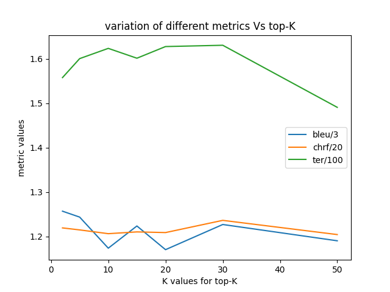
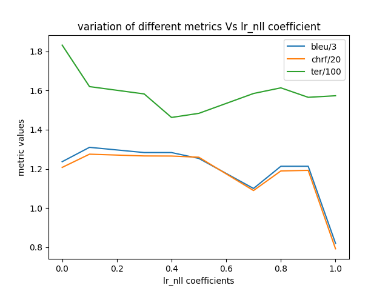
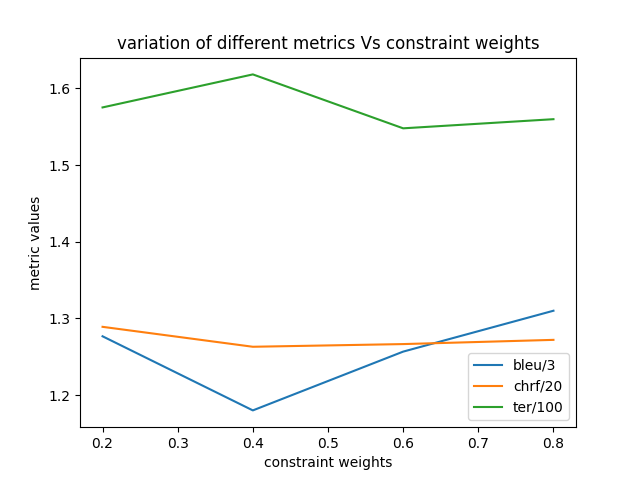
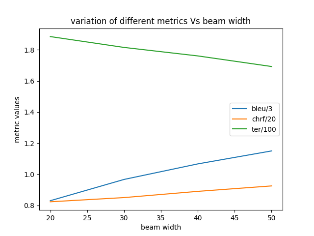

# Constrained Generation From Language Models Using Langevin Dynamics

1. Omkar Nitsure(210070057)
2. Sabyasachi Samantaray(210050138)
3. PLS Lokesh Reddy(210050118)
4. Duggineni Venkata Paneesh(210050048)

## Abstract

Language models now have the ability to generate sentences which are almost impossible to distinguish from real sentences. They excel in fluency but are very hard to control.

It is hence necessary to study the constrained generation from Language Models without compromising on fluency. It also is expensive to train Language Models from scratch, COLD [1] employs Langevin Dynamics for constrained decoding of LMs by proposing constraint functions modelled as EBMs. Similar work is done in MuCOLA [2], where they train a classifier to obtain loss for gradient descent on the energy function by following a MC defined by Langevin dynamics. we do an in-depth analysis of the proposed methods.

We measure performance in terms of sampled generation quality and choice of energy function. We perform experiments on a variety of tasks including constrained lexical generation, counterfactual reasoning, sentiment transfer. All code and work can be accessed [here](https://github.com/omkar-nitsure/Constrained-Sampling-from-LLMs).

## Introduction

A variety of methodologies have been proposed to address the challenge of constrained text sampling from language models, encompassing both supervised and unsupervised techniques.

In the realm of supervised approaches, Parshakova et al. [3] explored fine-tuning language model weights by introducing a log-linear component alongside standard auto-regressive outputs. This augmentation enables the incorporation of global a priori features to mitigate data scarcity. Their methodology involves initial training of the language model through likelihood maximization followed by a subsequent training stage aimed at approximating the generation distribution within an autoregressive framework.

Additionally, innovative techniques such as COLD Decoding [1] and MUCOLA [2] employ inference-time decoding using Langevin Dynamics to sample instances that minimize predetermined energy functions, while ensuring fluency in the generated output through language model integration. Li et al.'s Diffusion LM [4] stands out for training language models from scratch, utilizing diffusion model-based non-autoregressive models. Their approach involves backpropagating gradients of the energy function at each step of noise addition to the data, enabling complex constrained generation tasks such as maintaining syntactic structure.

Structured Voronoi sampling, as proposed by Amini et al. [5], addresses the issue of discretization-induced deviations from the true target distribution during inference. Their methodology involves leveraging discrete model output distributions to define continuous densities for gradient computation, employing an algorithm based on Hamiltonian Monte Carlo for subsequent sampling. Claiming superior constraint adherence and fluency in sentence generation compared to other gradient-based methods, their approach presents a promising avenue for constrained text sampling. A recent preprint by Du, Li et al. [6] introduces a Gaussian score-based technique for sampling, wherein Gaussian scores for each possible word are computed and renormalized to obtain probabilities. Similar to MUCOLA but with an additional constraint, this method ensures that adjacent words remain proximate in the embedding space.

Notably, this approach dispenses with a projection step, distinguishing it from MUCOLA and highlighting its potential for enhancing constraint fulfillment in text generation tasks.

In this study, we explore COLD decoding for various tasks like sentence generation with lexical constraints and a counterfactual statements generation. We also model energy function for novel task of sentiment transfer and utilize the idea of classifier from MUCOLA to enhance the formulation thereby providing enhanced results.

## Cold Decoding

This paper introduces deterministic constraint functions, referred to as energy functions, tailored to specific tasks. Sampling from language models to minimize these energy functions is achieved through Langevin Dynamics, employing gradient descent on the energy function. Notably, gradients of the energy function are computed concerning the soft language model (LM) outputs, despite tokens being discrete. This is accomplished by utilizing continuous model outputs for gradient computation, followed by top-K filtering-based discrete decoding to obtain word outputs. The central equation governing this process is as follows:

$${\tilde{y}}^{n+1}={\hat{y}}^{n} - \eta\nabla_{\hat{y}}E(\hat{y}) + \epsilon^{n}$$

The energy function used for lexical generation in COLD decoding is as follows -

$$E(\tilde{y})=\lambda_{a}^{l r}f_{L M}^{\rightarrow}(\tilde{y};x_{l}^{'})+\lambda_{a}^{r l}f_{L M}^{\leftarrow}(\tilde{y})+\lambda_{b}f_{s i m}(\tilde{y};x_{r})$$

## Mucola: Gradient-Based Constrained Sampling

The MUCOLA paper employs gradient-based sampling for constrained text generation, sharing similarities with COLD decoding while also featuring distinct characteristics. Notably, MUCOLA's energy functions rely on classifiers necessitating supervised training data. Examples of auxiliary tasks suitable for training these constraint functions include -
While integrating such classifiers introduces additional computational overhead, it becomes justifiable when conducting extensive sampling across various tasks and keywords. It's worth noting that this approach is susceptible to adversarial attacks. In contrast, methods like COLD,
employing deterministic constraint functions, are immune to such vulnerabilities.

## A. Some Limitation Of Cold And Mucola

The constraint functions employed in both the COLD and MuCOLA papers are defined differently and accept distinct inputs. COLD requires the input to its constraint functions to be logits, each corresponding to the vocabulary size. However, given that large language models
(LLMs) such as Llama and Mistral encompass trillions of tokens, this approach necessitates substantial computational resources for evaluating the constraint functions.

In contrast, MuCOLA utilizes constraints that operate on word embeddings as inputs, allowing for greater flexibility in dimensionality adjustment. This hyperparameter tuning enables fine-tuning of the generation quality.

A significant challenge with COLD lies in designing deterministic constraint functions for tasks like Toxicity Avoidance and Sentiment Control. Conversely, MuCOLA can be readily adapted to such tasks due to the availability of ample supervised training data for training classifiers.

## Code Survey

We refer to the official code for COLD [1] and MuCOLA[2] papers and make necessary modifications there. The github links are as follows -

1. COLD - <https://github.com/qkaren/COLDdecoding>
2. MuCOLA - <https://github.com/Sachin19/mucoco/tree/sampling>

## Datasets And Models

We will be using Datasets given in the github repositories we are referring to. We will additionally use some hand-made dataset as using large datasets is expensive both computationally and memory-wise.

We trained a sentiment classifier for doing supervised sampling from language models for the task of sentiment transfer. The data we used can be found here . We use GPT2-xl as the base language model to perform all the experiments.

## Our Work

We propose some additional implementations to check whether the COLD decoding method is faithfully generating text with constraints or not. Following are the modifications we have tried and their justification.

## A. Beam Search Decoding

The paper adopts a top-K sampling strategy for word token selection, favoring the word with the highest probability among the K choices offered by the model output. However, we perceive a potential compromise on fluency constraints due to this restrictive search method. To address this concern, we implemented Beam Search decoding, incorporating two levels of selection. In our implementation, we first select the top-K values for the next word prediction, followed by a Beam Search decoding algorithm. This algorithm retains only a subset of beams (m out of k) from the selected K logit values. This dual-level approach aims to enhance constraint satisfaction while preserving the fluency and coherence of the generated text.

A series of experiments were conducted, varying the relative values of k and m, and evaluating the results using metrics such as BLEU score, BERT score, and perplexity values. Our findings demonstrate improvements compared to the top-K filtering approach advocated in the paper, highlighting the efficacy of the proposed Beam Search decoding strategy. It's worth noting that while Beam Search decoding entails greater computational time than top-K filtering, the benefits in terms of text quality justify the additional processing overhead. We will show the results of beam-search decoding in Figure 2(b).

## B. Critical Words (For Lexical Generation Tasks)

Utilizing the GPT2-XL model for text generation, our evaluation investigates the susceptibility of the algorithm to word choice. Specifically, we identify words with consistently low probabilities and randomly generate sample sentences. Subsequently, we employ the model to generate next-token logits and compile a set of 100 consistently least probable words. These words serve as lexicographic constraints for the lexical generation task. The rationale behind this approach lies in the assumption that words with significantly low probabilities are unlikely to occur and/or co-occur frequently. Therefore, by utilizing these words as constraints, we aim to assess the model's ability to generate coherent and fluent sentences under challenging conditions. Termed "critical words," this set serves as a benchmark for evaluating the performance of our method in accurately modeling constraint generation distributions.

## C. Sentiment Transfer

In our study, we introduce a novel custom generation task termed "sentiment transfer," featuring distinctive constraint function definitions. The primary objective of this task is to manipulate the sentiment of input sentences, transitioning them from a negative to a positive tone. To achieve this, we define the following constraint functions:

$$E(\tilde{y})=\lambda_{a}^{lr}f_{LM}^{+}(\tilde{y})+\lambda_{a}^{l}f_{LM}^{+}(\tilde{y})+\lambda_{b}f_{sim}(\tilde{y};x)-\lambda_{c}f_{pred}(\tilde{y};x)-\lambda_{c}f_{pred}(x;\tilde{y})$$

$$E(\tilde{y})=\lambda_{a}^{lr}f_{LM}^{+}(\tilde{y})+\lambda_{a}^{l}f_{LM}^{+}(\tilde{y})+\lambda_{b}f_{sim}(\tilde{y};x)+\lambda_{c}P(next=Negative|\tilde{y})$$

The modeling approach described by equation 1 demonstrates a tendency to converge towards irrelevant solutions, irrespective of the original input sentence. Notably, as the parameter λb increases, the generated output tends to mirror the original sentence, indicating a significant flaw in the modeling approach. This behavior underscores the inadequacy of the terms fpred(*x; ˜y*) and f*pred*(˜y; x) in capturing the negative sentiment intended for generation. Conversely, employing equation 2 for modeling encourages the generation of words associated with negation. However, despite this improvement, the equation still struggles to produce fluent output. This highlights the complexity involved in accurately capturing and manipulating sentiment within generated text.

These observations underscore the need for further refinement and exploration of modeling techniques to effectively capture and manipulate sentiment in text generation tasks. In the preceding objective function, our aim is twofold: to preserve the semantic similarity between the generated text and the original input text, while simultaneously reducing the likelihood of predicting sentence endings given the input, thereby enforcing a change in tone. However, the results obtained from this approach, as detailed in Section 9, reveal significant inadequacies and poor performance. Upon analysis, it becomes apparent that the energy modeling employed is insufficient in effectively promoting the sentiment transfer task. To address this limitation, we propose an innovative solution inspired by MuCOLA. Specifically, we introduce a new loss component based on a sentiment classifier. The classifier, derived from a fine-tuned version of GPT-2 on sentiment classification data sourced from Kaggle 5, undergoes training for seven epochs. Subsequently, the loss function is defined as a straightforward cross-entropy loss between the predicted logits and a one-hot logit vector, with emphasis on tokens corresponding to negative sentiment.

## Evaluations

To comprehensively evaluate the quality of generated output, we employ a range of metrics. BERT score's Precision and Recall scores are calculated with respect to the reference texts, averaging the results across the number of reference texts. This metric serves as a measure of how closely the generated text aligns with the reference text, providing insights into its overall quality. In addition, we utilize perplexity score to assess the fluency of the sampled text.

Comparing the perplexity scores across different experiments allows us to gauge the fluency of text generated using various decoding techniques. Notably, we observe that text generated using beam search decoding exhibits higher fluency compared to that generated using top-K
decoding, while still ensuring constraint satisfaction.

## A. Metrics

We have developed an automated evaluation mechanism utilizing GPT-3.5 through Selenium, leveraging its API to assess generated text on two key metrics: Fluency and Meaningfulness.

GPT-3.5 serves as a reliable evaluator due to its high agreement ratio with human assessments, mirroring the level of agreement observed in human-to-human evaluations. To ensure the fidelity of GPT's evaluations, we conduct human evaluations in parallel. Our findings affirm the faithfulness of GPT's assessments, providing a reliable indication of the generated text's quality. Additionally, we employ the BLEU score metric to quantify the similarity between the generated sentences and their reference counterparts. It's important to note that the utility of this metric is contingent upon the availability of reference texts; the more diverse and plentiful the reference texts, the more informative the BLEU score becomes. In order to account for these considerations, our automated evaluation mechanism prompts GPT-3.5 to rate the generated sentences on a scale of 1 to 3, evaluating degrees of Constraint Satisfaction, Fluency, and Meaningfulness. This comprehensive approach enables a nuanced assessment of the generated text's quality.

Figure 1: BLEU, CHRF and TER scores with COLD modelling for constrained lexical generation when (left) Varying the top-K parameter (right) Varying the LR-NLL parameter

|||
|-|-|

Figure 2: BLEU, CHRF and TER scores with COLD modelling for constrained lexical generation when (left) Varying the AC2-W parameter (right) Varying the Beam-Width parameter

|||
|-|-|

when employing beam search

| Words Used     | Top K   | Length   | LR NLL   | CW   | AC2W   | Avg BLEU   | CS   | FL   | MN   |
|----------------|---------|----------|----------|------|--------|------------|------|------|------|
| Dev Set        | 2       | 10       | 0.6      | 0.5  | 0.1    | 3.77       | 2.08 | 2.23 | 2.01 |
| Dev Set        | 5       | 10       | 0.6      | 0.5  | 0.1    | 3.73       | 2.09 | 2.01 | 2.13 |
| Dev Set        | 10      | 10       | 0.6      | 0.5  | 0.1    | 3.52       | 2.09 | 1.88 | 2.1  |
| Dev Set        | 15      | 10       | 0.6      | 0.5  | 0.1    | 3.67       | 2.23 | 2.11 | 2.09 |
| Dev Set        | 20      | 10       | 0.6      | 0.5  | 0.1    | 3.51       | 2.21 | 2.09 | 2.14 |
| Dev Set        | 30      | 10       | 0.6      | 0.5  | 0.1    | 3.68       | 2.15 | 2.01 | 2.17 |
| Dev Set        | 50      | 10       | 0.6      | 0.5  | 0.1    | 3.57       | 2.18 | 2.03 | 2.18 |
| Dev Set        | 5       | 10       | 0.6      | 0.5  | 0      | 2.87       | 2.2  | 2.05 | 1.98 |
| Critical Words | 5       | 10       | 0.6      | 0.5  | 0.1    | 2.5        | 2.14 | 1.6  | 1.92 |

Table 1: Different values of top-K
CS means Constraint satisfaction, FL means Fluency and MN means Meaningfulness in the above table.

We observed that the BERT score remains same for different values of topk which indicates that the similarity remains the same for range of values of k. This can be seen in the above table where the CS values oscillate about 2.1. Also, fluency decreases with increasing value of K in topK filtering. The meaningfulness score remains fairly the same.

| Words Used   | Top K   | Length   | LR NLL   | CW   | AC2W   | Avg BLEU   | CS   | FL   | MN   |
|--------------|---------|----------|----------|------|--------|------------|------|------|------|
| Dev Set      | 5       | 10       | 0        | 0.5  | 0.1    | 3.71       | 1.88 | 1.9  | 2.08 |
| Dev Set      | 5       | 10       | 0.1      | 0.5  | 0.1    | 3.93       | 1.9  | 1.96 | 2.01 |
| Dev Set      | 5       | 10       | 0.3      | 0.5  | 0.1    | 3.85       | 1.9  | 1.94 | 2.11 |
| Dev Set      | 5       | 10       | 0.4      | 0.5  | 0.1    | 3.85       | 1.92 | 1.99 | 2.13 |
| Dev Set      | 5       | 10       | 0.5      | 0.5  | 0.1    | 3.76       | 1.99 | 2.03 | 2.13 |
| Dev Set      | 5       | 10       | 0.7      | 0.5  | 0.1    | 3.3        | 2.01 | 2.01 | 2.1  |
| Dev Set      | 5       | 10       | 0.8      | 0.5  | 0.1    | 3.76       | 1.96 | 2.11 | 2.01 |
| Dev Set      | 5       | 10       | 0.9      | 0.5  | 0.1    | 3.64       | 1.93 | 2.14 | 1.91 |
| Dev Set      | 5       | 10       | 1.0      | 0.5  | 0.1    | 2.46       | 1.98 | 2.1  | 1.95 |

Table 2: Different values of lr nll loss coefficients Here, we can see that the constraint satisfaction value increases very slowly. But, we can

| Words Used   | Top K   | Length   | LR NLL   | CW   | AC2W   | Avg BLEU   | CS   | FL   | MN   |
|--------------|---------|----------|----------|------|--------|------------|------|------|------|
| Dev Set      | 5       | 10       | 0.4      | 0.5  | 0.2    | 3.83       | 2.01 | 2.1  | 2.07 |
| Dev Set      | 5       | 10       | 0.4      | 0.5  | 0.4    | 3.54       | 2.09 | 2.02 | 2.06 |
| Dev Set      | 5       | 10       | 0.4      | 0.5  | 0.6    | 3.77       | 2.08 | 1.93 | 2.08 |
| Dev Set      | 5       | 10       | 0.4      | 0.5  | 0.8    | 3.93       | 2.11 | 1.95 | 2.01 |

see the clear increase in the Fluency value as the LR NLL coefficient increases. Meaningfulness remains fairly constant.

Table 3: Different values of ac2w coefficients As the value of constraint coefficient is increased, Constraint satisfaction score improves while both the fluency and meaningfulness reduce very slowly. We can observe that COLD
decoding does not define any constraint for meaningfulness and thus the meaningfulness score continues to be the same as we change different hyperparameters.

## Potential Divergence From Target Distribution

A latest preprint by Du, Li et.al [6] claims that no gradient based method converges to the true target distribution in the limit and thus generate suboptimal results. They show that Voronoi sampling comes closest to the true target distribution among all other methods based on Langevin Dynamics.

Langevin Dynamics is based on the equation below -

$$\hat{y}^{n+1}=\hat{y}^{n}-\eta\nabla_{\bar{y}}E(\hat{y}^{n})+\epsilon^{n}$$

The COLD paper claims that choosing an appropriate amount of noise ϵ and learning rate scheduler η(t), the algorithm will converge to samples of the true distribution [7]. To ensure convergence to a local maximum, in addition to other technical assumptions, a major requirement is for the step sizes to satisfy the properties -

$$\sum_{1}^{\infty}\epsilon_{t}=\infty\qquad\sum_{1}^{\infty}\epsilon_{t}^{2}=\infty$$

Typically, step sizes vary as

$$\epsilon_{t}=a(b+t)^{-\gamma}\qquad\gamma\in(0.5,1]$$

The first constraint on ϵ ensures that the parameters reach the high probability regions irrespective of initialization. The reduction in step size will ensure that the parameters will actually converge and not oscillate.

## References

[1] L. Qin, S. Welleck, D. Khashabi, and Y. Choi, "Cold decoding: Energy-based constrained text generation with langevin dynamics," *Advances in Neural Information Processing Systems*, vol. 35, pp. 9538–9551, 2022.

[2] S. Kumar, B. Paria, and Y. Tsvetkov, "Gradient-based constrained sampling from language models," *arXiv preprint arXiv:2205.12558*, 2022.

[3] T. Parshakova, J.-M. Andreoli, and M. Dymetman, "Global autoregressive models for dataefficient sequence learning," in Proceedings of the 23rd Conference on Computational Natural Language Learning (CoNLL) (M. Bansal and A. Villavicencio, eds.), (Hong Kong, China),
pp. 900–909, Association for Computational Linguistics, Nov. 2019.

[4] X. Li, J. Thickstun, I. Gulrajani, P. S. Liang, and T. B. Hashimoto, "Diffusion-lm improves controllable text generation," *Advances in Neural Information Processing Systems*, vol. 35, pp. 4328–4343, 2022.

[5] A. Amini, L. Du, and R. Cotterell, "Structured voronoi sampling," Advances in Neural Information Processing Systems, vol. 36, 2024.

[6] L. Du, A. Amini, L. T. Hennigen, X. V. Yu, J. Eisner, H. Lee, and R. Cotterell,
"Principled gradient-based markov chain monte carlo for text generation," *arXiv preprint* arXiv:2312.17710, 2023.

[7] M. Welling and Y. W. Teh, "Bayesian learning via stochastic gradient langevin dynamics,"
in *Proceedings of the 28th international conference on machine learning (ICML-11)*, pp. 681–
688, Citeseer, 2011.

## Appendix

Following are some of the samples generated for lexical generation, sentiment transfer and counterfactual generation.

For the constrained lexical generation task, we notice an overall improvement in generation quality when employed beam search, instead of direct top-K choosing. The constraint words are look, field, stand

- The first time I ever heard of the stand for the right to bear arms was in the late 1960s, when I was a student at the University of California, Berkeley.

- The last stand of field marshal is over. The last of the defenders of the Empire is dead.

- The new year is upon this field- of the Lord, and the Lord hath given unto you a new commandment, that ye shall not covet your neighbor's house or his wife.c Following are some of the best samples when the constraint set is the combination of critical words appropriately-massive-corrosion-saturation
- The United States has appropriately massive corrosion saturation. - A new appropriately massive corrosion-resistant saturation coating has been applied to the exterior of the vehicle.

- The appropriately massive and corrosion saturation-resistant T-1 is a great choice for the serious gamer.

•
Some good samples for the critical keyword constraint set automobiles-entitlement-occupation

- The world occupation entitlement is a entitlement to a certain amount of land, and the world occupation entitlement is a right to occupy that land.

- The U.S. Supreme Court automobiles entitlement program is a program that provides a tax credit to owners of certain model year 1997 and later model year 1997 and later vehicles.

- A new study published in automobiles entitlement to the American Journal of Public Health found that the average driver spends $,000 a year on gas, and that the average driver spends $1,000.

Following are some of the good counterfactual generated endings when corresponding to the premise - "Ryan was called by his friend to skip work one day.", initial - "He missed his train to work and instead went to the park." counterfactual - "But Ryan had an important project at work and went in to finish it.", original-ending - "Ryan and his friend played with birds at the park all day. At the end of the day, they left the park and saw Ryan's boss. Ryan got fired."

- When he came back, his friend was gone with birds and the car. He was like, 'What the hell is going on?'
- When he came back, the friend was waiting and called it a day. He was a very nice man.

Following are some of the failed counterfactual generated endings when corresponding to the premise-"Neil had been journeying through Asia." initial-"Now he had worked his way south into Australia." counterfactual-"But he contracted malaria on a Thai island, and had to be flown home for treatment." original-ending: "Neil was so excited to see Australian culture. He was thrilled at the prospect of exotic animals and people! His favorite moment was when he got to feed a baby koala bear.",

- Neil was so excited to see his family see his culture, see who culture
- I was so excited to see him culture. I was so excited to see him culture. I was so excited to see him culture.

Following are the sentiment transfer completions generated by the modelling approach - 1 for the original-statement : "She admired the man for his honesty."

- The first time I saw the movie, I was in the theater with my family.

- The U.S. government has been trying to get the U.N. Security Council to pass a resolution that would impose sanctions on North Korea for its recent nuclear test.

Following are the best sentiment transfer completions when used modelling approach - 2 for the original-statement : "She admired the man for his honesty."

- She did not admired the man and was in the theater to see him. - I was so admired the man for no honesty and her.

- The US admired the man for his honesty and not the she is not.
